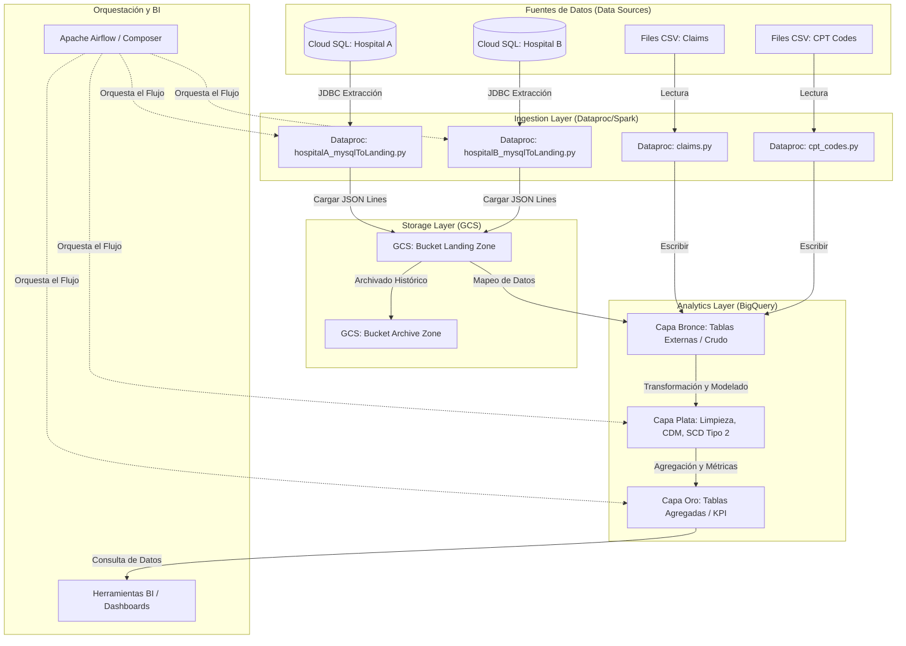

# MANUAL PASO A PAASO: VISTA GENERAL (OVERVIEW) DEL PROYECTO
## Gestión del Ciclo de Ingresos Sanitarios (Healthcare RCM) en Google Cloud Platform

> ### 📍 Ubicación del Código y Scripts del Proyecto
> Este manual introductorio provee la visión general de negocio y la arquitectura conceptual. Los componentes de código técnico que se ejecutan a lo largo del pipeline están distribuidos en las siguientes rutas relativas del repositorio:
> * **Scripts de Ingesta PySpark (Python):** [Scripts/](../Scripts/)
> * **Scripts SQL de BigQuery:** [data/BQ/](../data/BQ/)
> * **DAGs de Orquestación de Airflow (Python):** [workflows/](../workflows/)
> * **Archivo de Configuración CI/CD:** [cloudbuild.yaml](../cloudbuild.yaml)


Bienvenido al manual paso a paso del proyecto **GCP End-to-End Healthcare Revenue Cycle Management (RCM)**. Este documento ha sido diseñado como una guía didáctica y técnica completa para entender el flujo de datos del sector salud desde su origen hasta la visualización analítica.

---

## 📖 Tabla de Contenidos
1. [Introducción y Contexto de Negocio (RCM)](#1-introducción-y-contexto-de-negocio-rcm)
2. [Entidades Clave del Dominio de Salud](#2-entidades-clave-del-dominio-de-salud)
3. [Arquitectura Técnica de Extremo a Extremo en GCP](#3-arquitectura-técnica-de-extremo-a-extremo-en-gcp)
4. [Flujo de Ingesta y Aterrizaje (Fase 1)](#4-flujo-de-ingesta-y-aterrizaje-fase-1)
5. [Procesamiento Analítico en BigQuery: Arquitectura Medallón (Fase 2)](#5-procesamiento-analítico-en-bigquery-arquitectura-medallón-fase-2)
6. [Estándar de Nomenclatura y Modelado de Datos](#6-estándar-de-nomenclatura-y-modelado-de-datos)
7. [Orquestación y Automatización (Fase 3)](#7-orquestación-y-automatización-fase-3)

---

## 1. Introducción y Contexto de Negocio (RCM)

La **Gestión del Ciclo de Ingresos (RCM - *Revenue Cycle Management*)** es el proceso financiero que los proveedores de servicios médicos (como hospitales, clínicas y médicos) utilizan para administrar los aspectos clínicos y de facturación de la atención al paciente. 

El ciclo comprende desde el registro inicial del paciente y la programación de la cita hasta la resolución final del saldo de su cuenta.

### El Flujo de Dinero y Datos en el Dominio de Salud:
```
+-------------------+      +-------------------+      +-------------------+
|  1. Visita del     | ---> | 2. Servicios      | ---> | 3. Generación de  |
|     Paciente      |      |    Prestados      |      |    Factura        |
+-------------------+      +-------------------+      +-------------------+
                                                                |
                                                                v
+-------------------+      +-------------------+      +-------------------+
| 6. Monitoreo y    | <--- | 5. Cobro y        | <--- | 4. Reclamación    |
|    Optimización   |      |    Seguimiento    |      |    al Seguro      |
+-------------------+      +-------------------+      +-------------------+
```

1. **Visita del Paciente:** El paciente ingresa al hospital por una dolencia o consulta. Se registran sus datos demográficos e información del seguro de salud.
2. **Servicios Prestados:** El médico (**Proveedor**) diagnostica y trata al paciente en un departamento específico. Esto se documenta bajo un identificador único de visita conocido como **Encounter**.
3. **Generación de Factura:** Los servicios prestados y tratamientos médicos se valorizan en una factura del hospital.
4. **Reclamación al Seguro (Claims):** El hospital envía una reclamación detallada a la compañía aseguradora para recibir el pago.
5. **Cobro y Seguimiento:** La aseguradora revisa la reclamación y puede pagarla en su totalidad, de forma parcial (donde entra a tallar el **copago** del paciente), o rechazarla. Se hace seguimiento de los saldos pendientes.
6. **Monitoreo y Optimización:** El equipo directivo del hospital analiza estos flujos financieros para evaluar la estabilidad económica y la eficiencia operativa.

> [!IMPORTANT]
> **El rol del Ingeniero de Datos:** Consiste en extraer datos dispersos en diversas fuentes operacionales, diseñar e implementar un pipeline ETL/ELT robusto para limpiar y unificar la información de múltiples hospitales, y cargarla en un Data Warehouse (BigQuery) para la toma de decisiones basada en datos.

---

## 2. Entidades Clave del Dominio de Salud

Para procesar adecuadamente la información, debemos mapear y comprender los objetos de datos del negocio:

| Entidad de Datos | Nombre Técnico / Prefijo | Descripción |
| :--- | :---: | :--- |
| **Paciente (Patient)** | `pacient` / `pac` | Persona que recibe el tratamiento médico. Incluye nombre, seguro y fecha de nacimiento. |
| **Proveedor (Provider)** | `provider` / `prov` | El médico o especialista que ofrece los servicios clínicos. Identificado de forma oficial por su NPI (*National Provider Identifier*). |
| **Departamento (Department)** | `department` / `dep` | Unidad especializada dentro del hospital (ej. Oncología, Emergencia, Pediatría) donde se atiende al paciente. |
| **Encuentro (Encounter)** | `encounter` / `enc` | Registro temporal e histórico de la interacción del paciente con el hospital (visita ambulatoria, emergencia, hospitalización). |
| **Transacción (Transaction)** | `transaction` / `trx` | Registros financieros y contables asociados al encuentro (costos de procedimientos, cobros, cargos de facturación). |
| **Reclamación (Claims)** | `claim` | Archivos planos CSV mensuales con información de transacciones procesadas con las aseguradoras (aprobados, rechazados, copagos). |
| **Códigos CPT** | `cpt` | *Current Procedural Terminology*. Códigos numéricos estandarizados a nivel internacional que clasifican los procedimientos médicos realizados por el proveedor. |

---

## 3. Arquitectura Técnica de Extremo a Extremo en GCP

La arquitectura del proyecto está construida sobre **Google Cloud Platform (GCP)** y sigue las mejores prácticas de escalabilidad empresarial y procesamiento moderno:



---

## 4. Flujo de Ingesta y Aterrizaje (Fase 1)

El proceso de extracción de datos operacionales es administrado mediante **Google Cloud Dataproc (Spark/PySpark)**:

### A. Extracción desde Bases de Datos Cloud SQL (MySQL)
Los scripts [hospitalA_mysqlToLanding.py](../Scripts/hospitalA_mysqlToLanding.py) y [hospitalB_mysqlToLanding.py](../Scripts/hospitalB_mysqlToLanding.py) se conectan a bases de datos relacionales independientes y realizan lo siguiente:
1. **Configuración de carga:** Leen un archivo CSV de configuración centralizado en GCS (`configs/load_config.csv`) para determinar si las tablas están activas y definir su tipo de carga (**Full** o **Incremental**).
2. **Carga Incremental y Watermarking:** 
   - Utilizan una tabla de auditoría en BigQuery (`audit_log`) para consultar el timestamp de la última carga exitosa (`load_timestamp`).
   - Generan dinámicamente consultas SQL parametrizadas para traer solo registros nuevos:
     ```sql
     SELECT * FROM {table} WHERE {watermark_col} > '{last_watermark}'
     ```
3. **Control de Archivo Histórico (Archive):** Antes de escribir nuevos archivos JSON en la landing zone, los scripts mueven los archivos preexistentes a una estructura jerárquica de archivo histórico organizada por fechas:
   `landing/{HOSPITAL_NAME}/archive/{table}/{year}/{month}/{day}/{filename}.json`
4. **Almacenamiento en GCS:** Escriben el DataFrame en formato JSON con la estructura JSON Lines (un registro por fila) directamente en el bucket de GCS:
   `gs://{GCS_BUCKET}/landing/{HOSPITAL_NAME}/{table}/{table}_{timestamp}.json`
5. **Auditoría y Logging:** Actualizan la tabla de auditoría (`audit_log`) en BigQuery y cargan un archivo JSON de logs con el estado de la ejecución a GCS.

### B. Ingesta de Archivos Planos (Claims y CPT Codes)
- **Claims (Reclamaciones):** El script [claims.py](../Scripts/claims.py) lee de forma masiva los CSV mensuales de aseguradoras, determina el origen de datos de manera automatizada usando `input_file_name()`, elimina registros duplicados y escribe directamente en BigQuery (`bronze_dataset.claims`).
- **CPT Codes:** El script [cpt_codes.py](../Scripts/cpt_codes.py) lee el catálogo de códigos médicos y estandariza los nombres de columnas reemplazando espacios por guiones bajos y transformando el texto a minúsculas, subiendo el resultado a `bronze_dataset.cpt_codes`.

---

## 5. Procesamiento Analítico en BigQuery: Arquitectura Medallón (Fase 2)

El procesamiento de datos en BigQuery se divide en tres capas conceptuales que garantizan la trazabilidad del linaje de datos:

```
[ GCS JSON / CSV ] 
        │
        ▼
┌────────────────────────────────────────────────────────┐
│ 1. CAPA BRONCE (Raw Data)                              │
│ - Tablas externas en BigQuery que apuntan a GCS.        │
│ - Almacenan los datos tal y como vienen del origen.    │
└────────────────────────────────────────────────────────┘
        │
        ▼
┌────────────────────────────────────────────────────────┐
│ 2. CAPA PLATA (Cleaned & Integrated Data)              │
│ - Limpieza profunda: SAFE_CAST, SAFE_DIVIDE.           │
│ - Unificación en un Modelo de Datos Común (CDM).       │
│ - Control de histórico de cambios con SCD Tipo 2.      │
└────────────────────────────────────────────────────────┘
        │
        ▼
┌────────────────────────────────────────────────────────┐
│ 3. CAPA ORO (Reporting & Gold Layer)                   │
│ - Tablas desnormalizadas de hechos y dimensiones.      │
│ - Agregaciones optimizadas listas para dashboards (BI).│
└────────────────────────────────────────────────────────┘
```

### Capa Bronce (Raw Layer)
La capa bronce está implementada mediante **Tablas Externas** en BigQuery. El script SQL [bronze.sql](../data/BQ/bronze.sql) crea estas definiciones. Al ser tablas externas, no almacenan datos físicamente en BigQuery, sino que leen directamente los JSONs/CSVs desde Google Cloud Storage cuando se ejecuta una consulta, reduciendo costos de almacenamiento redundantes en la primera fase.

### Capa Plata (Silver Layer)
Es la fase crucial donde se realiza la transformación, consistencia e integración de la información:
* **Modelo de Datos Común (CDM):** Dado que el Hospital A y el Hospital B manejan llaves primarias independientes que podrían solaparse (por ejemplo, Paciente ID `1` en Hospital A y Paciente ID `1` en Hospital B no representan a la misma persona), se crea una unificación de esquemas para consolidar ambas fuentes en una sola entidad estructurada de salud, evitando duplicidades lógicas.
* **SCD Tipo 2 (Slowly Changing Dimensions):** Mantiene un registro histórico de cambios en las dimensiones (como actualizaciones en la dirección del paciente o datos de seguro). Esto se logra agregando campos de fecha de vigencia (`fec_inicio_validez`, `fec_fin_validez`) y flags de estado activo (`flg_activo`).
* **Tratamiento de Nulos y Tipado:** Se aplican conversiones de tipos seguras para evitar errores en tiempo de ejecución.

### Capa Oro (Gold Layer)
La capa de salida final. Aquí los datos se organizan bajo un modelo dimensional (Estrella o Copo de Nieve) con tablas de hechos (`fact_transactions`, `fact_encounters`) y tablas de dimensiones (`dim_patients`, `dim_providers`). El objetivo de esta capa es maximizar el rendimiento de las consultas y simplificar el análisis directo desde herramientas de Business Intelligence como Looker Studio, Power BI o Tableau.

---

## 6. Estándar de Nomenclatura y Modelado de Datos

Para asegurar que todo el datalake mantenga una coherencia técnica e institucional, seguimos rigurosamente la **Especificación de Nomenclatura de Datos de Alicorp (REQ1)**. 

### A. Nombres de Datasets y Tablas
* **Prefijo de Datasets:**
  - Capa Golden/Oro: `gld_` (ej. `gld_inventario`, `gld_cliente`).
  - Capa de Entrega/BI: `delivery_` (ej. `delivery_dex`, `delivery_cliente`).
* **Reglas de Tablas:**
  - Golden: Nombradas en **singular** con el prefijo del origen del dato (ej. `sidex_dex_material`).
  - Delivery: Nombradas en **singular** y obligatoriamente con el prefijo `cr_` (ej. `cr_venta_reestructurada`).

### B. Nomenclatura Estándar de Columnas
Las columnas deben nombrarse en singular, español y utilizar abreviaturas normalizadas al inicio del nombre del campo:

| Prefijo | Tipo de Dato BigQuery | Uso / Regla de Valor | Ejemplo |
| :---: | :---: | :--- | :--- |
| `id` | `STRING` | Llaves únicas de origen (IDs) | `id_material` |
| `cod` | `STRING` | Códigos alfanuméricos | `cod_tipo_material` |
| `des` | `STRING` | Textos descriptivos de negocio | `des_material` |
| `nom` | `STRING` | Nombres de personas/entidades | `nom_cliente` |
| `est` | `STRING` | Estados de negocio o procesos | `est_cliente` |
| `tip` | `STRING` | Descripciones de tipos o categorías | `tip_documento` |
| `flg` | `BOOLEAN` | Flags condicionales (`true`/`false`) | `flg_conductor` |
| `num` | `NUMERIC` o `INTEGER` | Valores secuenciales, parámetros o enteros | `num_tiempo_entrega` |
| `mnt` | `NUMERIC(18, 4)` | Montos financieros de alta precisión | `mnt_limite_pagar` |
| `cnt` | `NUMERIC` o `INTEGER` | Cantidades físicas de elementos | `cnt_stock` |
| `fec` | `DATE` o `DATETIME` | Fechas válidas de negocio | `fec_inicio_validez` |
| `prc` | `NUMERIC(18, 4)` | Porcentajes (almacenados como fracción, ej. 1 = 100%) | `prc_pedido_rechazado` |
| `val` | `STRING` | Coordenadas o códigos que no deben convertirse | `val_coordenada_x` |
| `hor` | `TIME` | Marcas horarias específicas | `hor_creacion` |

### C. Reglas de SQL Obligatorias
1. **Tratamiento de Nulos:** Reemplazar los valores nulos en columnas descriptivas o códigos por la cadena de control `'Sin Asignar'`.
   ```sql
   IFNULL(cod_unidad_medida, 'Sin Asignar') AS cod_unidad_medida
   ```
2. **Uso de Conversiones Seguras:** Utilizar únicamente la función `SAFE_CAST` para conversiones y `SAFE_DIVIDE` para operaciones matemáticas con riesgo de divisiones entre cero o nulos.
3. **Cabecera de Control de Cambios:** Todo script SQL (DDL/DML) debe poseer comentarios superiores detallando el usuario creador, la fecha y el historial de modificaciones.
4. **Particionamiento y Filtro Obligatorio:** Las tablas transaccionales o históricas deben configurarse con particionamiento mensual basado en una columna tipo fecha (`periodo`), la cual debe ubicarse físicamente en la primera posición de la tabla. Además, se debe activar la restricción de optimización:
   ```sql
   PARTITION BY DATE_TRUNC(periodo, MONTH)
   OPTIONS (
     require_partition_filter = true
   )
   ```
5. **Columna Técnica `fec_proceso`:** Todas las tablas de las capas superiores deben incluir como última columna el campo `fec_proceso DATETIME`, calculada con:
   ```sql
   CURRENT_DATETIME('America/Lima') AS fec_proceso
   ```

---

## 7. Orquestación y Automatización (Fase 3)

El pipeline de extremo a extremo está completamente automatizado y controlado sin intervención manual utilizando **Apache Airflow**:

1. **Un DAG por Carpeta:** Se mantiene la política técnica de diseñar un solo archivo DAG de Airflow para orquestar la ejecución de los scripts contenidos dentro de cada carpeta física de DML.
2. **Definición de Dependencias (`parameters.json`):** Cada modelo contiene un archivo JSON que parametriza su flujo de ejecución en Airflow:
   - Configura el `write_disposition` de carga (ej. `WRITE_TRUNCATE`).
   - Declara de manera explícita el array de dependencias (`dag_dependencies`), indicando qué DAGs predecesores deben finalizar con éxito antes de disparar el pipeline actual.
   - Especifica la tabla física de base de control en la base de datos de auditoría (`dependencies_table`).
3. **Tablas de Monitoreo Centralizado:**
   - `config_tablas_ingesta`: Registra el estado activo de cada tabla, la última ejecución, la cantidad de registros ingestados y la variación de volumen.
   - `config_dependencias_dag`: Controla las relaciones lógicas y jerarquías entre los distintos pipelines del Datalake.
